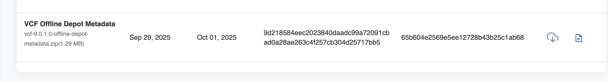
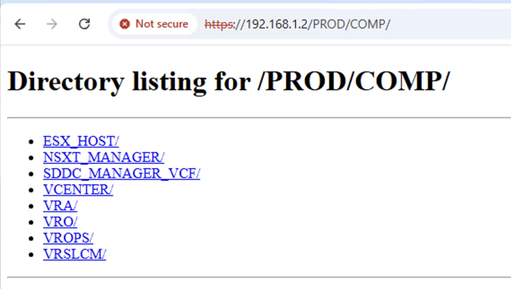
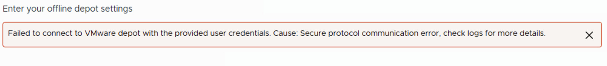

# VCF-Upgrade 9.0 -> 9.0.1

## Create off line Depot

```
A Server with disk space is need!
I used my Linix jump server and added an extra disk with 2TB
And then a https server with auth is needed vor the VCF upgrade
```

# Adding disk space
```
#in vCenter add a disk to your linux jump host VM
```


```
#Disk shows up as adb
	lsblk
#sdb                         8:16   0     2T  0 disk
#
# looks like sdb      8:16   0  150G  0 disk  is my new disk 
	sudo parted /dev/sdb
	mklabel gpt
	print
	mkpart primary 0 1995GB
	Ignore
	quit
	sudo mkfs.ext4 /dev/sdb1
	sudo mkdir /bigdisk
	sudo mount /dev/sdb1 /bigdisk
	
	sudo blkid /dev/sdb1

#/dev/sdb1: UUID="9dd30ea6-ddb9-4396-98fa-f5eeddface3d" BLOCK_SIZE="4096" TYPE="ext4" PARTLABEL="primary" PARTUUID="4c81fe73-c946-41b4-9890-268dd2ca2683"
#UUID=9dd30ea6-ddb9-4396-98fa-f5eeddface3d /mnt/mydrive ext4 defaults 0 0

#add this to vfstab: /dev/disk/by-uuid/9dd30ea6-ddb9-4396-98fa-f5eeddface3d /mnt/mydrive ext4 defaults 0 0

sudo vi /etc/vfstab
```

# Creating quick https server

```
Following William: https://williamlam.com/2025/01/quick-tip-easily-host-vmware-cloud-foundation-vcf-offline-depot-using-python-simplehttpserver-with-authentication.html

#Quick test for the web server
sudo python3 -m http.server 9000

#Test with above sript
sudo python3 http_server_auth.py --bind 127.0.0.1 --user vcf --password vcf123! --port 8888 --directory depot
```
# Create cert

```
openssl genpkey -algorithm RSA -out key.pem
openssl req -new -key key.pem -out csr.pem -subj "/C=US/ST=CA/L=Dallas/O=OrfGelbrich/OU=R&D/CN=linuxjum.lab.local"
openssl x509 -req -in csr.pem -signkey key.pem -out cert.crt -days 365
```

# Offline Depot metadata

```
https://support.broadcom.com/group/ecx/productfiles?displayGroup=VMware%20Cloud%20Foundation%209&release=9.0.1.0&os=&servicePk=534266&language=EN&groupId=534924&viewGroup=true

# Note!: I had to login and then re-run the link to get to the metadata file

```



# Move file from windows to linux jump host

```
scp .\vcf-9.0.1.0-offline-depot-metadata.zip orf@192.168.1.2:/tmp/.
```

# Create dir structure

```
sudo cp /tmp/vcf-9.0.1.0-offline-depot-metadata.zip /bigdisk
cd /bigdisk
sudo unzip vcf-9.0.1.0-offline-depot-metadata.zip

```

# Start web server

```
sudo python3 ./http_server_auth.py --bind 192.168.1.2 --user vcf --password vcf123! --port 443 --directory /bigdisk/VCF9 --certfile ~/cert.crt --keyfile ~/key.pem
```




# Download and move to bigdisk software (My Windows machine does not alot of space so this has the done in batches)

```
#move from windows to Linux
scp VMware-ESXi-9.0.1.0.24957456-depot.zip orf@192.168.1.2:/bigdisk/orf/.
scp VMware-vCenter-Server-Appliance-9.0.1.0.24957454-updaterepo.zip orf@192.168.1.2:/bigdisk/orf/.
scp vmsp-vcfa-combined-9.0.1.0.24965341.tar orf@192.168.1.2:/bigdisk/orf/.
scp VCF-OPS-Lifecycle-Manager-9.0.1.0.24960371.patch orf@192.168.1.2:/bigdisk/orf/.
scp Operations-Upgrade-9.0.1.0.24960352.pak orf@192.168.1.2:/bigdisk/orf/.
scp Operations-Logs-Appliance-9.0.1.0.24960345.pak orf@192.168.1.2:/bigdisk/orf/.
scp vidb-external-9.0.1.0.24941398.tar orf@192.168.1.2:/bigdisk/orf/.
scp VMware-NSX-upgrade-bundle-9.0.1.0.0.24952111-pre-check.pub orf@192.168.1.2:/bigdisk/orf/.
scp VMware-NSX-upgrade-bundle-9.0.1.0.0.24952111.mub orf@192.168.1.2:/bigdisk/orf/.
scp VMware-Cloud-Foundation-Operations-for-Networks.9.0.1.0.24950933.upgrade.bundle orf@192.168.1.2:/bigdisk/orf/.

#sudo su
#and copy into respective directories

mv /bigdisk/orf/VMware-ESXi-9.0.1.0.24957456-depot.zip /bigdisk/VCF9/PROD/COMP/ESX_HOST/.
mv /bigdisk/orf/VMware-vCenter-Server-Appliance-9.0.1.0.24957454-updaterepo.zip  /bigdisk/VCF9/PROD/COMP/VCENTER/.
mv /bigdisk/orf/VMware-NSX-upgrade-bundle-9.0.1.0.0.24952111-pre-check.pub  /bigdisk/VCF9/PROD/COMP/NSXT_MANAGER/.
mv /bigdisk/orf/VMware-NSX-upgrade-bundle-9.0.1.0.0.24952111.mub  /bigdisk/VCF9/PROD/COMP/NSXT_MANAGER/.
mv /bigdisk/orf/VCF-OPS-Lifecycle-Manager-9.0.1.0.24960371.patch  /bigdisk/VCF9/PROD/COMP/VRSLCM/.
mv /bigdisk/orf/vmsp-vcfa-combined-9.0.1.0.24965341.tar /bigdisk/VCF9/PROD/COMP/VRA/.
mv /bigdisk/orf/Operations-Upgrade-9.0.1.0.24960352.pak  /bigdisk/VCF9/PROD/COMP/VROPS/.

```

# Error in adding Depot to OPS manager? 



```
# if you have this error the cert needs to be placed with SDDC manager


```


